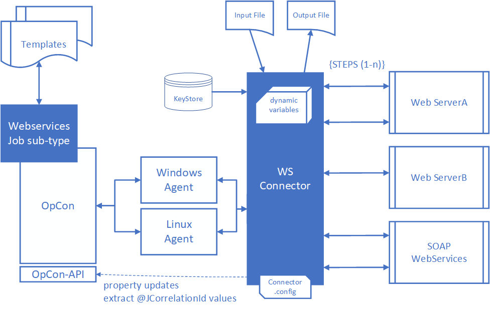
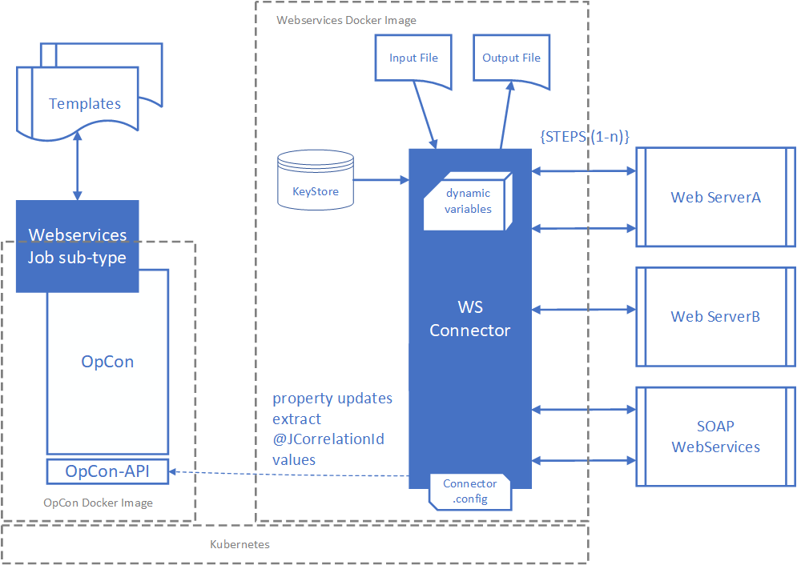

# Webservices Connector

## What is it?

The Webservices Connector is a REST-API connector that supports a multi-step capability. Each step is a separate request to a web server using the GET, POST, PUT or DELETE functions. Steps run in sequence with the possibility of extracting data from the returned payload and passing this to subsequent steps.

The connector supports application/json, application/xml, application/x-www-form-urlencoded, multipart/form-data, text/xml and text/plain Content-Types. However, only application/json and application/xml Content-Types support attribute value extraction using the JSONPath capabilities for JSON data and XPath capabilities for XML data.

The connector supports the capability to submit requests to SOAP Webservices by submitting a POST request and encapsulating the SOAP XML definition in the message body.

It is therefore possible to create a workflow within a single OpCon job definition that consists of multiple steps that can access different web servers using either http or https protocols. Information can be extracted from the returned data of any step and this can be passed to subsequent steps. It is also possible to read or write data from files for each step.

Variables and Environment Variables can be defined which can then be used as parameters in the data being submitted to the web servers. User and password information can also be passed as variables with the possibility of password information being stored in encrypted global properties.

Attribute values can be extracted from returned data and passed to subsequent steps. The connector uses the JSONPath (for JSON) and XPath (for XML) capabilities to define the attribute value to extract from the returned data.

A Docker image containing the Webservices Connector within a Linux environment is available from Docker Hub.

The connector includes a job sub-type (Web Services) that can be used to define the jobs.

The connector supports the concept of templates. A template is a JSON formatted SMAWSConnector job definition which can be loaded into the job sub-type by selecting the **Import Template** function. The template includes the global values (variables, environment variables and property) associated with the job definitions.

Once a job definition is complete, it is possible to create a template by selecting the **Export Template** function. When creating templates using the **Export Template** function, the variable and environment variables values are replaced with the `??????` string to prevent the inadvertent export of sensitive data.

The connector supports a set of specific variables `@User`, `@Password`, `@Domain`, `@JCorrelationid`, `@CertStore`, `@CertStorePwd` and `@CertStoreType`. The `@User`, `@Password` and `@Domain` variables are used to pass credentials for authentication, the `@JCorrelationid` is used to retrieve the unique job identifier of a job in the daily, and the `@CertStore`, `@CertStorePwd` and `@CertStoreType` values are used for client certificate authentication. The `@JCorrelationId` identifier can be used as a call back value to the OpCon environment from an external source.

The connector supports the capability to write extracted variable values into OpCon properties (global and instance properties). If the destination property does not exist, it will be created.

The connector supports the use of a proxy server either for all jobs associated with the connector or for a specific step within a job.

## FAQs

**Which content types support data extraction?**
Only `application/json` and `application/xml` support attribute value extraction. JSON data uses JSONPath syntax; XML data uses XPath syntax.

**Can the connector call SOAP web services?**
Yes. SOAP requests are submitted as a POST with the SOAP XML definition placed in the message body and a Content-Type of `text/xml`.

**Where can the connector run?**
On any Linux or Windows server where an OpCon Agent is installed, or as a Docker image from Docker Hub in the `smatechnologies` repository.

**How are credentials handled?**
Credentials are passed using the `@User`, `@Password`, and `@Domain` variables. Password values may be stored in encrypted OpCon global properties so they are not exposed in plain text.

**How does the connector pass data between steps?**
Each step can extract values from the returned payload using JSONPath or XPath and store them in response variables. Subsequent steps reference those variables in URLs, headers, or message bodies.

**Does the connector support proxy servers?**
Yes. A proxy server can be configured globally in `Connector.config` for all jobs, or per step in the **Proxy Server** field of the **Step** definition. A step-level value overrides the configuration value.

## Glossary

| Term | Definition |
|------|------------|
| Step | A single request to a web server within a Webservices Connector job. Steps run in sequence. |
| Template | A JSON-formatted SMAWSConnector job definition that can be imported into the **Web Services** job sub-type. |
| JSONPath | A query syntax used to identify and extract values from JSON data. |
| XPath | A query syntax used to identify and navigate nodes in an XML document. |
| Variable | A named value, prefixed with `@`, that the connector substitutes into URLs, headers, or message bodies at run time. |
| Environment Variable | A variable, prefixed with `@`, passed to the agent through the OS environment rather than through the JSON job definition. Used when values would otherwise break JSON parsing. |
| Response Variable | A variable populated from the returned payload of a step using JSONPath, XPath, or header parsing, for use by subsequent steps. |
| Special Variable | A reserved variable name (`@User`, `@Password`, `@Domain`, `@JCorrelationid`, `@CertStore`, `@CertStorePwd`, `@CertStoreType`) that the connector recognizes for credentials, correlation, or certificate handling. |
| @JCorrelationid | A reserved variable used to retrieve the unique job ID of the next job in the daily so that an external system can return a completion status through the OpCon REST API. |
| Connector.config | The configuration file that defines the data directory, proxy settings, and OpCon REST API connection details used by the connector. |
| Web Services job sub-type | The Enterprise Manager job sub-type, installed by the connector plug-in, used to define Webservices Connector jobs. |
